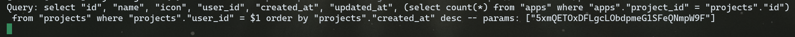
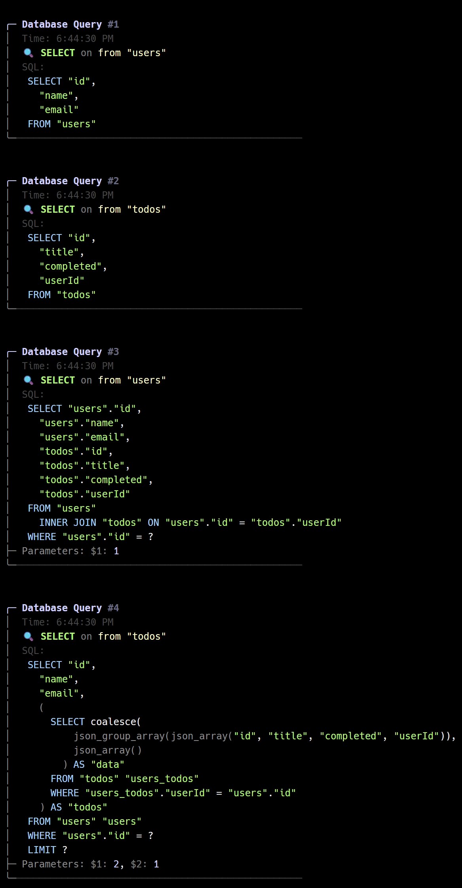

# 🎨 drizzle-query-logger

A beautiful, enhanced logger for Drizzle ORM that transforms your SQL queries into visually appealing, color-coded output with syntax highlighting, icons, and detailed formatting.

## 📸 Before vs After

### Before (Default Drizzle Logger)


### After (Enhanced Query Logger)


*See the dramatic difference! The enhanced logger transforms plain SQL output into beautifully formatted, color-coded queries with syntax highlighting, icons, and structured parameter display.*

## ✨ Features

- 🎨 **Beautiful formatting** with box-drawing characters and colors
- 🔍 **SQL syntax highlighting** with keyword colorization
- 📊 **Query type detection** with specific colors and icons
- 🏷️ **Table name extraction** and highlighting
- 📝 **Parameter formatting** with type-specific colors
- ⏰ **Timestamps** for each query
- 🔢 **Query numbering** to track execution order
- ⚙️ **Configurable** logging output

## 📦 Installation

```bash
npm install drizzle-query-logger
```

```bash
yarn add drizzle-query-logger
```

```bash
pnpm add drizzle-query-logger
```

```bash
bun add drizzle-query-logger
```

## 🚀 Usage

### Basic Usage

```typescript
import { createClient } from '@libsql/client/sqlite3';
import { drizzle } from 'drizzle-orm/libsql';
import { EnhancedQueryLogger } from 'drizzle-query-logger';

const client = createClient({ url: ':memory:' });
export const db = drizzle(client, {
  logger: new EnhancedQueryLogger(),
});

// Your queries will now be beautifully logged!
const users = await db.select().from(usersTable);
```

### With Custom Logger Function

```typescript
import { EnhancedQueryLogger } from 'drizzle-query-logger';

const logger = new EnhancedQueryLogger({
  log: (message) => {
    // Send to your preferred logging service
    console.log(message);
    // or use your custom logger
    // winston.info(message);
    // pino.info(message);
  }
});

export const db = drizzle(client, { logger });
```

## 🎯 Query Types & Icons

The logger automatically detects and styles different query types:

| Query Type | Icon | Color  |
|------------|------|--------|
| SELECT     | 🔍   | Green  |
| INSERT     | 📝   | Blue   |
| UPDATE     | ✏️   | Yellow |
| DELETE     | 🗑️   | Red    |
| CREATE     | 🏗️   | Magenta|
| DROP       | 💥   | Red    |
| ALTER      | 🔧   | Cyan   |
| OTHER      | ⚡   | White  |

## 🛠️ Configuration

### Constructor Options

```typescript
interface LoggerOptions {
  log?: (message: string) => void;
}
```

- **`log`**: Custom logging function (default: `console.log`)

### Example with Custom Configuration

```typescript
const logger = new EnhancedQueryLogger({
  log: (message) => {
    // Custom logging logic
    if (process.env.NODE_ENV === 'development') {
      console.log(message);
    } else {
      // Send to logging service in production
      yourLoggingService.debug(message);
    }
  }
});
```

## 🎨 Color Scheme

The logger uses a carefully chosen color scheme for optimal readability:

- **Keywords**: Blue (SELECT, FROM, WHERE, etc.)
- **Strings**: Green
- **Numbers**: Cyan
- **Booleans**: Yellow
- **Objects**: Magenta
- **Null values**: Dimmed
- **Table names**: Yellow
- **Framework elements**: Gray with cyan accents

## 🔧 TypeScript Support

This package is written in TypeScript and provides full type definitions. It implements Drizzle's `Logger` interface:

```typescript
import type { Logger } from 'drizzle-orm/logger';

export class EnhancedQueryLogger implements Logger {
  logQuery(query: string, params: unknown[]): void;
}
```

## 📋 Requirements

- **Node.js**: 16+ 
- **TypeScript**: 5+ (peer dependency)
- **Drizzle ORM**: Compatible with all recent versions

## 🤝 Contributing

Contributions are welcome! Please feel free to submit a Pull Request.

## 📄 License

MIT License - see the [LICENSE](LICENSE) file for details.

## 🙏 Acknowledgments

Built for the [Drizzle ORM](https://orm.drizzle.team/) ecosystem.

## ⭐ Star History

## Star History

<a href="https://www.star-history.com/#max-programming/drizzle-query-logger&Date">
 <picture>
   <source media="(prefers-color-scheme: dark)" srcset="https://api.star-history.com/svg?repos=max-programming/drizzle-query-logger&type=Date&theme=dark" />
   <source media="(prefers-color-scheme: light)" srcset="https://api.star-history.com/svg?repos=max-programming/drizzle-query-logger&type=Date" />
   
 </picture>
</a>